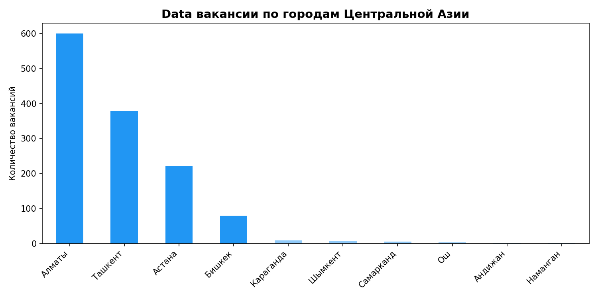
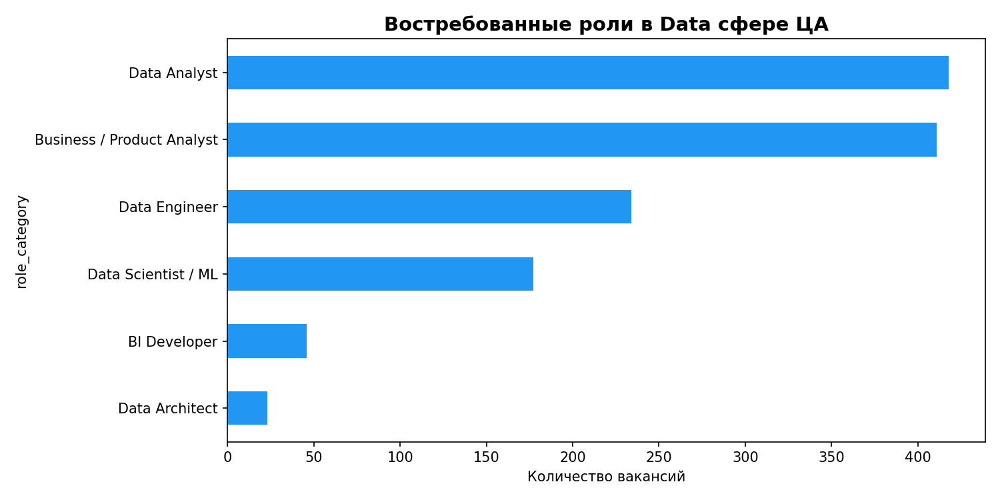
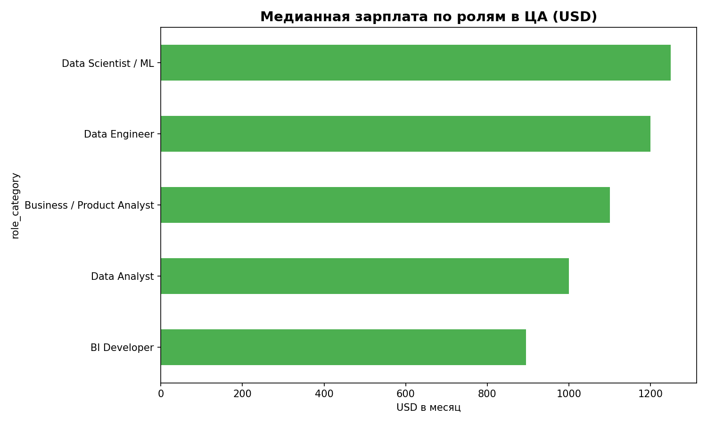
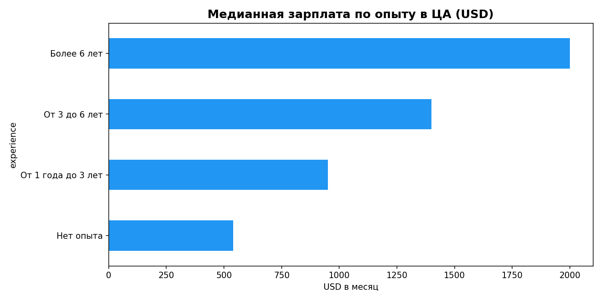
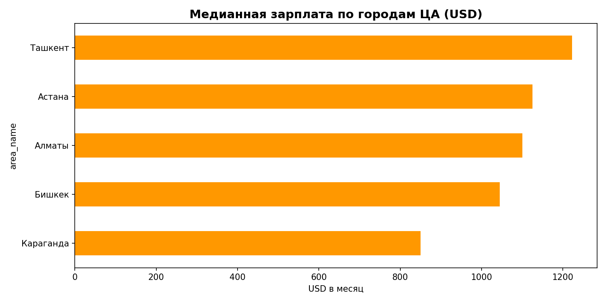
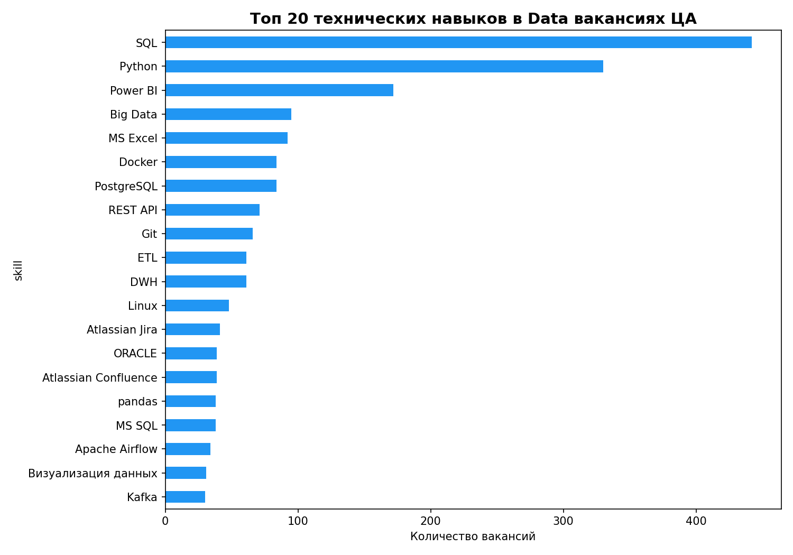
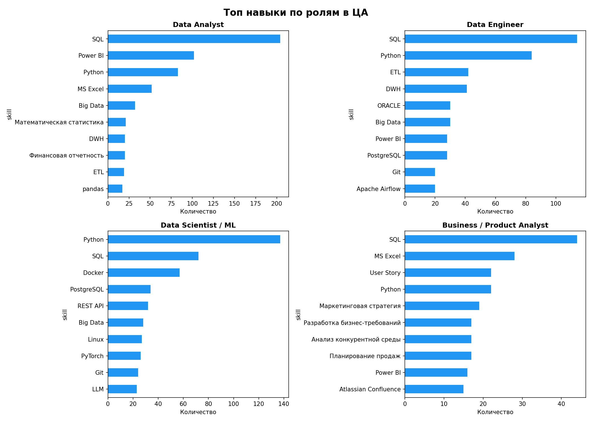
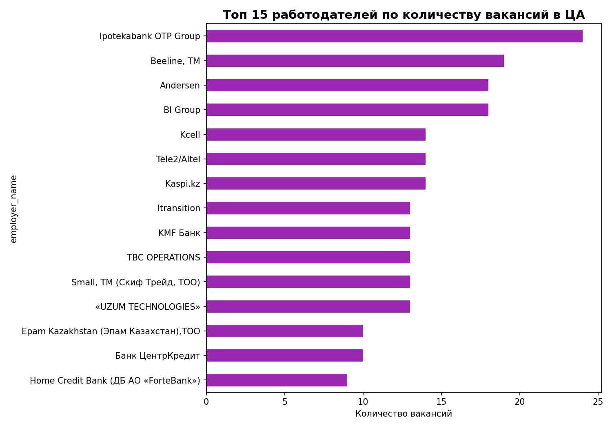

# 📊 Рынок IT-вакансий в Центральной Азии: Data & Analytics 2026

> **Источник данных:** hh.ru API · **Дата сбора:** июнь 2026 · **Охват:** 1 310 уникальных вакансий

---

## 🗺️ Общая картина

Это исследование охватывает **рынок труда в сфере данных** по трём ключевым странам Центральной Азии:

| Страна | Столица | Основные города |
|--------|---------|-----------------|
| 🇰🇿 Казахстан | Астана | Алматы, Астана, Шымкент |
| 🇺🇿 Узбекистан | Ташкент | Ташкент |
| 🇰🇬 Кыргызстан | Бишкек | Бишкек, Ош |

Анализ охватывает **11 поисковых ролей**: Data Analyst, Data Engineer, Data Scientist, Business Analyst, BI Analyst, Product Analyst, SQL Analyst, AI Engineer, ML Engineer, ETL Developer, NLP Engineer.

---

## География: Где сосредоточены вакансии?



### Топ-3 города

| Место | Город | Вакансий | Доля |
|-------|-------|----------|------|
| 🥇 1 | **Алматы** | ~600 | ~46% |
| 🥈 2 | **Ташкент** | ~378 | ~29% |
| 🥉 3 | **Астана** | ~221 | ~17% |

**Алматы** — безоговорочный лидер. Несмотря на то, что Астана является столицей Казахстана, именно Алматы сохраняет роль главного IT-хаба страны. Здесь сосредоточены крупнейшие технологические компании: Kaspi.kz, Beeline, Kcell, Freedom Finance, Kolesa.kz.

**Ташкент** уверенно занимает второе место — активно развивающийся IT-рынок Узбекистана притягивает как местных специалистов, так и релокантов. Здесь активны Ipotekabank, TBC Operations, Uzum Technologies.

**Бишкек** и другие города представлены значительно скромнее, но рынок там растёт.

---

## 💼 Роли: Кого ищут чаще всего?



### Распределение по категориям ролей

| Роль | Описание |
|------|---------|
| **Data Analyst** | Классический аналитик данных, SQL, BI-инструменты |
| **Business / Product Analyst** | Анализ бизнес-процессов, работа с продуктом |
| **Data Engineer** | ETL, DWH, пайплайны данных |
| **Data Scientist / ML** | Машинное обучение, AI-разработка |

Наибольший спрос — на **аналитиков данных** (Data Analyst + Business Analyst). Это характерно для зрелого рынка, где компании активно внедряют data-driven подход в операционную деятельность.

**Data Engineer** — вторая по популярности техническая роль. Это отражает тренд на построение data-платформ и централизованных хранилищ данных.

**ML/AI** специалисты занимают отдельную нишу: рынок пока формируется, но спрос растёт быстро, особенно в банках и финтех-компаниях.

---

## 💰 Зарплаты: Сколько платят?

> **Важно:** Только ~23% вакансий (307 из 1310) указывают зарплату. Остальные ~77% — без зарплатной вилки. Анализ ведётся по доступным данным.

### Зарплаты по ролям



| Роль | Медиана (USD/мес) | Диапазон |
|------|-------------------|----------|
| Data Scientist / ML | **$1 250** | $400 – $6 000+ |
| Data Engineer | **$1 200** | $500 – $5 500 |
| Business / Product Analyst | **$1 100** | $400 – $4 000 |
| Data Analyst | **$1 000** | $170 – $3 700 |

**Выводы:**
- ML/AI специалисты получают на ~20–25% больше аналитиков данных
- Data Engineer — в топе по оплате среди инженерных ролей

### Зарплаты по опыту



| Опыт | Медиана (USD/мес) | Рост |
|------|-------------------|------|
| Без опыта | **$540** | — |
| 1–3 года | **$950** | +76% |
| 3–6 лет | **$1 400** | +47% |
| 6+ лет | **$2 000** | +43% |

**Ключевой вывод:** Самый большой зарплатный скачок — при переходе от "без опыта" к "1–3 года" (+76%). Первый коммерческий опыт даёт почти двойной рост дохода.

### Зарплаты по городам



| Город | Медиана (USD/мес) |
|-------|-------------------|
| Алматы | ~$1 100 |
| Астана | ~$1 050 |
| Ташкент | ~$900 |
| Бишкек | ~$950 |

Алматы традиционно предлагает немного более высокие зарплаты — сказывается высокая конкуренция и концентрация крупных компаний.

---

## 🛠️ Навыки: Что нужно знать?



### Топ технических навыков (по всему рынку)

| Место | Навык | Почему важен |
|-------|-------|-------------|
| 🥇 1 | **SQL** | Базовый навык для любого аналитика данных |
| 🥈 2 | **Python** | Основной язык для DS/ML и анализа данных |
| 🥉 3 | **Power BI** | Самый распространённый BI-инструмент в регионе |
| 4 | **Docker** | Контейнеризация, важна для Data Engineers |
| 5 | **PostgreSQL** | Основная СУБД в большинстве компаний |
| 6 | **Git** | Базовый навык для любого технического специалиста |
| 7 | **ETL** | Ключевой навык для Data Engineers |
| 8 | **Tableau** | Альтернатива Power BI, популярна в крупных компаниях |
| 9 | **Apache Spark** | Big Data стек |
| 10 | **Airflow** | Оркестрация пайплайнов |

### Навыки по ролям



**Data Analyst:** SQL, Excel/Google Sheets, Power BI / Tableau, Python (pandas, matplotlib)

**Data Engineer:** Python, SQL, Apache Spark, Airflow, Docker, Kafka, PostgreSQL / ClickHouse

**Data Scientist / ML:** Python (scikit-learn, PyTorch, TensorFlow), SQL, Git, Docker, MLflow

**Business Analyst:** SQL, Excel,Power BI

> **Вывод:** SQL + Python + Power BI — это минимальный набор навыков, достаточный для старта в большинстве аналитических ролей региона. Для инженерных ролей дополнительно нужны Docker и Airflow.

---

## 💻 Формат работы (Удаленка vs Офис)

Хоть график и не выведен в отдельный, данные показывают чёткий тренд:
* **Гибрид и Офис** преобладают в вакансиях начального уровня (Junior/Middle). Компании хотят видеть сотрудников в офисе для онбординга и контроля.
* **Удаленка** чаще предлагается для Senior-позиций (особенно Data Engineer и ML Engineer). Компании готовы нанимать удалённо, чтобы получить редкую экспертизу.

> **Вывод:** Если вы ищете полностью удалённую работу из другой страны, ваши шансы резко возрастают при наличии опыта от 3-х лет и экспертизы в DE или DS.

---

## 🏢 Топ работодатели



### Наиболее активные рекрутёры

| Компания | Страна | Специализация |
|----------|--------|--------------|
| **Ipotekabank OTP Group** | 🇺🇿 Узбекистан | Банк, активно строит data-команду |
| **Kaspi.kz** | 🇰🇿 Казахстан | SuperApp, крупнейшая data-платформа в ЦА |
| **Beeline (ТМ)** | 🇰🇿 Казахстан | Телеком, большие данные |
| **Andersen** | 🇰🇿🇺🇿 | IT-аутсорсинг, множество data-ролей |
| **BI Group** | 🇰🇿 Казахстан | Строительный холдинг с большим IT-отделом |
| **KMF Банк** | 🇰🇿 Казахстан | Микрофинансы, активно нанимает ML-инженеров |
| **Tele2/Altel** | 🇰🇿 Казахстан | Телеком, Big Data |
| **Kcell** | 🇰🇿 Казахстан | Телеком, аналитика |
| **Freedom Finance** | 🇰🇿 Казахстан | Финтех, инвестиции |
| **TBC OPERATIONS** | 🇺🇿 Узбекистан | Банк, цифровые продукты |

---

## 📈 Структура опыта

| Требуемый опыт | Вакансий |
|----------------|----------|
| Нет опыта | 51 (4%) |
| 1–3 года | 510 (39%) |
| 3–6 лет | 614 (47%) |
| 6+ лет | 134 (10%) |

**Основной спрос:** Middle-специалисты с опытом 1–6 лет. Рынок испытывает дефицит именно в этом сегменте.

Только **4% вакансий** открыты для кандидатов без опыта — это значит, что Junior-специалисту нужно быть очень хорошо подготовленным, чтобы конкурировать на рынке.

---

## 🔍 Ключевые инсайты

### 1. Финансовый сектор — главный нанимат
Банки и финтех-компании (Kaspi, Ipotekabank, KMF, TBC, ForteBank) — крупнейшие работодатели в сфере данных. Финансовый сектор хорошо платит и активно внедряет ML для кредитного скоринга, фрод-детекции и персонализации.

### 2. SQL — must-have для всех
SQL упоминается в вакансиях чаще всего вне зависимости от роли. Это фундаментальный навык, без которого невозможно войти в профессию.

### 3. Power BI доминирует в BI-стеке
В регионе Power BI значительно популярнее Tableau и Qlik. Знание Power BI существенно увеличивает шансы на найм.

### 4. Рост AI/ML направления
Запросы "AI Engineer", "ML Engineer" и "LLM Engineer" активно появляются в 2025–2026 годах. Банки и телеком-компании начали активно строить AI-команды, что создаёт дефицит специалистов и высокие зарплаты в этом сегменте.

### 6. Спрос на гибридных специалистов (T-shaped)
Многие работодатели ищут специалистов на стыке: Data Analyst, который умеет настраивать простые ETL-пайплайны (как Data Engineer), или Business Analyst с продвинутым знанием SQL и Python. Строгое разделение ролей размывается.

---

## 💡 Рекомендации

### Для начинающих специалистов
1. **Освойте SQL в первую очередь** — это откроет двери в 90% вакансий.
2. **Добавьте Python** (pandas, matplotlib/seaborn, sklearn).
3. **Изучите Power BI** — самый востребованный BI-инструмент в регионе.
4. **Создайте портфолио** — даже 2–3 учебных проекта с реальными данными (парсинг сайтов, анализ открытых датасетов региона) увеличат шансы.
5. **Нацельтесь на финтех** — банки и финтех-компании охотно берут Junior с хорошей базой.
6. **Рассмотрите вакансии в офисе/гибрид** — удалёнку джунам дают редко, так как офис ускоряет рост за счёт прямого общения с опытными наставниками.

### Для Middle-специалистов
1. **Специализируйтесь** — выберите Data Engineering или Data Science и углубляйтесь.
2. **Изучите облачные технологии** (AWS/GCP/Azure) — спрос в ЦА стремительно растёт.
3. **Обязательно знайте Docker и Git** — это базовое ожидание от специалиста уровня Middle+.
4. **Изучите Airflow** — оркестрация пайплайнов всё чаще требуется даже аналитикам.
5. **Прокачайте soft skills и Data Storytelling** — умение донести бизнесу инсайты ценится на вес золота и прямо конвертируется в прибавку к зарплате.

### Для Senior-специалистов
1. **Рассмотрите роль Tech Lead / Head of Data** — острый дефицит на рынке управленцев с техническим бэкграундом открывает отличные перспективы.
2. **Экспертиза в AI/LLM** — компании готовы платить значительный премиум ($2000–$6000+) за интеграцию генеративных моделей в бизнес.
3. **Менторство** — возможность быстро растить джунов внутри компании также повышает вашу ценность.

### Для работодателей
1. **Инвестируйте в Junior-программы** — дефицит Middle-специалистов можно решить только выращивая кадры внутри компании.
2. **Публикуйте точный стек технологий** — сильные кандидаты всё чаще выбирают работодателя по инструментам, с которыми предстоит работать.

---


### Стек технологий
```
hh.ru API → Python (requests) → JSON → PostgreSQL
                                         ↓
                              pandas · matplotlib · seaborn
```

### Сбор данных
- **API:** hh.ru Public API
- **Регион:** Казахстан (area_id: 40), Узбекистан (area_id: 97), Кыргызстан (area_id: 48)
- **Поисковые запросы:** 11 ролей (на русском и английском языках)
- **Период:** апрель–июнь 2026

### Обработка данных
- **Дедупликация:** по ID вакансии
- **Нормализация зарплат:** конвертация KZT, UZS, KGS, EUR, RUR в USD по актуальному курсу
- **Категоризация ролей:** ручная разметка по `role_category`

### Ограничения
- Только 23% вакансий имеют указанную зарплату → зарплатный анализ неполный
- hh.ru не охватывает все платформы (LinkedIn, HeadHunter UZ и др.)
- Некоторые нерелевантные вакансии могли попасть в датасет через широкие поисковые запросы

---

## 📁 Структура репозитория

```
hh_central_asia/
├── data/
│   ├── raw/              # Сырые JSON с API (20 файлов)
│   └── processed/
│       └── vacancies_clean.csv   # Основной датасет (1310 строк)
├── notebooks/
│   ├── 01_edu.ipynb      # Exploratory Data Analysis
│   ├── 02_cleaning.ipynb # Очистка данных
│   ├── 03_skills.ipynb   # Анализ навыков
│   └── 04_salary.ipynb   # Анализ зарплат
├── reports/              # Графики (PNG)
│   ├── cities.png
│   ├── roles.png
│   ├── salary_by_city.png
│   ├── salary_by_experience.png
│   ├── salary_by_role.png
│   ├── skills_by_role.png
│   ├── top_employers.png
│   └── top_tech_skills.png
├── src/
│   ├── parser.py         # Сбор данных с hh.ru API
│   ├── loader.py         # Загрузка в PostgreSQL
│   └── cleaner.py        # Очистка и нормализация
├── tests/
│   └── test_cleaner.py
├── README.md
└── ANALYSIS.md           # ← Этот документ
```

---

*Анализ подготовлен на основе данных hh.ru · Центральная Азия · Июнь 2026*
